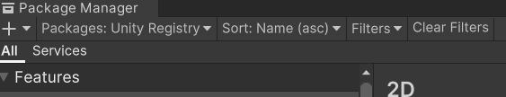
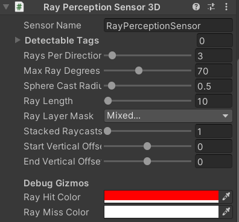
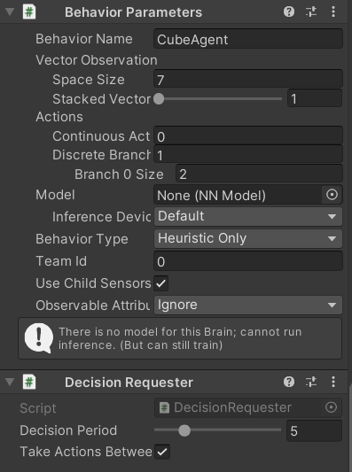
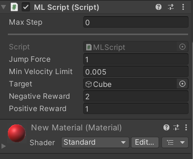

# Jumpter-assignment-MauroSterckx
## Namen
- Mauro Sterckx (2ITCSC1)
- Enrique Bataire (2ITSOF)
##
## Tutorial
1. Start een unity scene
2. Plaats een 'plane', dit is de vloer
3. Plaats een 'cube', dit is de jumper
4. Plaats een andere 'cube', dit wordt de balk

5. Geef de objecten kleuren indien je dit wenst

### Scaling
6. Pas de scaling van de 'plane' aan naar: X2, Y2, Z5
7. Pas de scaling van de balk aan naar: X13, Y1, Z1

### Import ML Package
8. Open de Unity Package manager (window > package manager)
9. Klik linksboven op de Packages en zorg dat je 'In Registery' hebt geselecteerd, zie foto <br>

10. Selecteer en installeer de ML agents package

### Jumper setup
11. Zorg voor de volgende parameters voor de jumper:
<br>

<br>


### Jumper script
12. Clone het jumperscript vanuit dit project en plaats het in je unity project folder
13. Clone de configfile vanuit dit project en plaats dit in de folder 'config'
14. Zorg voor de volgende parameters
<br>


### Anaconda
14. Open je Anaconda environment 
15. cd naar je projectfolder
16. Plak dit commando: ```mlagents-learn Config/CubeAgent.yaml --run-id=CubeAgent --resume``` in de terminal
17. Navigeer terug naar unity en druk Play, nu zou de jumper moeten jumpen over de obstacels